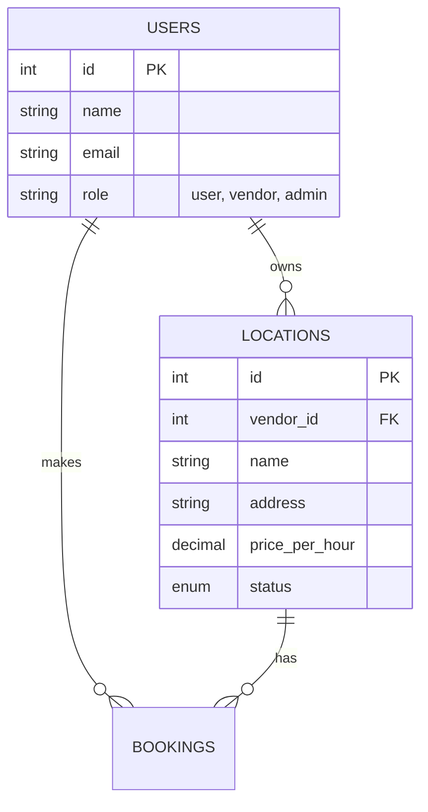
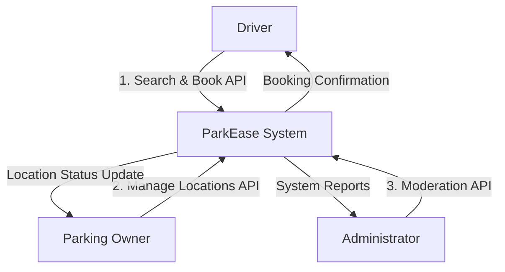
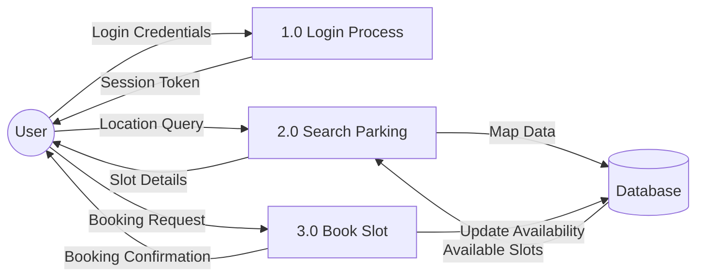
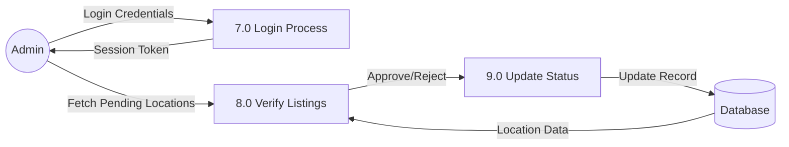

# PROJECT REPORT ON PARKEASE

**Submitted by:**
[Your Name/Group Members]

**Supervised by:**
[Supervisor Name]

---

## Abstract

rapid urbanization has led to a significant increase in vehicle ownership, resulting in acute parking shortage problems in urban areas. "ParkEase" is a web-based smart parking system designed to alleviate this issue by bridging the gap between drivers looking for parking and property owners with available space. The system allows users (drivers) to search for parking spots on a map, view real-time availability, and book slots in advance. Simultaneously, it empowers vendors (property owners) to list their unused parking spaces and monetize them. An administrative module ensures system integrity through verification and management. This project aims to reduce traffic congestion caused by parking searching, save time for drivers, and provide an efficient management platform for parking resources.

---

## Acknowledgement

We would like to express our sincere gratitude to our supervisor, [Supervisor Name], for their guidance and support throughout this project. We also thank our faculty and the department for providing the necessary resources and environment to complete this work.

---

## Table of Contents

-   **List of Figures**
-   **List of Tables**
1. **Chapter 1: Introduction**
    - 1.1 Introduction
    - 1.2 Problem Statement
    - 1.3 Objectives
    - 1.4 Scope and Limitation
    - 1.5 Report Organization
2. **Chapter 2: Background Study and Literature Review**
    - 2.1 Background Study
    - 2.2 Literature Review
3. **Chapter 3: System Analysis and Design**
    - 3.1 System Analysis
    - 3.2 System Design
4. **Chapter 4: Implementation and Testing**
    - 4.1 Implementation
    - 4.2 Testing
5. **Chapter 5: Conclusion and Future Recommendations**
    - 5.1 Lesson Learnt / Outcome
    - 5.2 Conclusion
    - 5.3 Future Recommendations
6. **References**

---

## List of Figures
1.  Figure 1: Entity Relationship Diagram (ERD)
2.  Figure 2: Level 0 DFD (Context Diagram)
3.  Figure 3: Level 1 DFD - User Module
4.  Figure 4: Level 1 DFD - Vendor Module
5.  Figure 5: Level 1 DFD - Admin Module

## List of Tables
1.  Table 1: Database Schema - Users Table
2.  Table 2: Database Schema - Locations Table
3.  Table 3: Database Schema - Bookings Table
4.  Table 4: Unit Test Cases
5.  Table 5: System Test Cases

---

## Chapter 1: Introduction

### 1.1 Introduction
Parking is a crucial component of modern urban transportation infrastructure. As cities grow, the demand for parking spaces often outstrips supply, leading to congestion, pollution, and frustration. "ParkEase" is developed to address these challenges by digitizing the parking process. It is a web application that connects drivers with parking space owners, facilitating real-time booking and management of parking slots.

### 1.2 Problem Statement
Finding a parking spot in busy urban areas is time-consuming and stressful. Drivers often circle around blocks, wasting fuel and increasing carbon emissions. On the other hand, many private property owners have vacant spaces that remain unutilized. There is a lack of a unified platform that connects these two parties efficiently. Existing solutions are often fragmented or lack real-time data, leading to a suboptimal user experience.

### 1.3 Objectives
The primary objectives of the ParkEase project are:
1.  **To develop a user-friendly web platform** for booking parking spaces online.
2.  **To enable real-time search** of parking spots using interactive maps (Leaflet API).
3.  **To provide a monetization avenue** for property owners (vendors) to list their spaces.
4.  **To implement a robust administrative panel** for monitoring and managing the system.
5.  **To reduce traffic congestion** associated with searching for parking.

### 1.4 Scope and Limitation
**Scope:**
-   **User Module**: Registration, Login, Search Parking, View Details, Book Slot, Booking History.
-   **Vendor Module**: Registration, List Parking Spots, Manage Availability, View Booking Requests.
-   **Admin Module**: User/Vendor Management, Approve/Reject Parking Listings, System Oversight.
-   **Web Interface**: Accessible via standard web browsers.

**Limitaitons:**
-   The system currently relies on manual status updates for entry/exit (unless integrated with IoT hardware in future).
-   Payment processing is simulated or manual (proof of payment upload) in the current version.
-   Requires internet connectivity to function.

### 1.5 Report Organization
The report is organized as follows: Chapter 1 introduces the project. Chapter 2 covers background and literature. Chapter 3 details system analysis and design including ERDs and DFDs. Chapter 4 describes implementation and testing. Chapter 5 concludes the report with future recommendations.

---

## Chapter 2: Background Study and Literature Review

### 2.1 Background Study
The development of ParkEase requires an understanding of web technologies and database management. The system is built using the **LAMP/XAMPP stack** concept (though genericized here):
-   **Frontend**: HTML5, CSS3, JavaScript for a responsive user interface.
-   **Backend**: PHP for server-side logic and request processing.
-   **Database**: MySQL for relational data storage.
-   **Mapping**: Leaflet.js for open-source interactive maps.

Standard architectural patterns like **MVC (Model-View-Controller)** are utilized to separate concerns, ensuring code maintainability and scalability.

### 2.2 Literature Review
Smart parking systems have been a subject of research for years.
-   *Existing IoT Solutions*: Many studies focus on sensor-based systems where hardware detects car presence. While accurate, these are expensive to deploy.
-   *Crowdsourced Models*: Similar to Airbnb, platforms exist for sharing economy models in parking. ParkEase adopts this approach, minimizing infrastructure costs by utilizing existing private spaces.
-   *Comparative Analysis*: Unlike traditional parking systems that only manage commercial lots, ParkEase creates a marketplace for micro-parking spots, increasing overall city parking capacity.

---

## Chapter 3: System Analysis and Design

### 3.1 System Analysis
#### 3.1.1 Requirement Analysis
**Functional Requirements:**
1.  **User Booking System**: Users must be able to search for available parking slots based on location and book a specific time slot.
2.  **Vendor Location Management**: Vendors must be able to add new parking locations with details (image, price, slots) and manage their availability.
3.  **Admin Verification**: Administrators must review and approve or reject parking locations added by vendors to ensure data quality and safety.

**Non-Functional Requirements:**
1.  **Performance**: The system should load map data and search results within 2 seconds under normal load.
2.  **Security**: User passwords must be encrypted using BCrypt; the system must prevent SQL injection and XSS attacks.
3.  **Reliability**: The system should maintain 99.9% uptime validation during business hours.
4.  **Usability**: The user interface must be responsive and accessible on both desktop and mobile devices.
5.  **Scalability**: The backend architecture must support horizontal scaling to handle simultaneous requests from at least 1000 concurrent users.

#### 3.1.2 Feasibility Analysis
-   **Technical Feasibility**: The project uses standard, open-source technologies (PHP, MySQL, JS) which are well-documented and supported.
-   **Operational Feasibility**: The system requires no special hardware for users, only a smartphone or computer with internet access.
-   **Economic Feasibility**: Low development cost as it uses open-source software; potential revenue model through booking commissions makes it economically viable.
-   **Schedule Feasibility**: The modular design allows for development within the academic timeline.

#### 3.1.3 Data Modeling (ER-Diagram)
The core entities in the system are Users, Locations, and Bookings.

**Figure 1: Entity Relationship Diagram (ERD)**

    BOOKINGS {
        int id PK
        int user_id FK
        int location_id FK
        datetime start_time
        datetime end_time
        enum status
    }
```

#### 3.1.4 Process Modeling (DFD)
**Level 0 DFD (Context Diagram):**

**Figure 2: Level 0 DFD (Context Diagram)**

**Level 1 DFD - User Module:**

**Figure 3: Level 1 DFD - User Module**

**Level 1 DFD - Vendor Module:**
```mermaid
graph LR
    Vendor((Vendor)) -->|Login Credentials| P4[4.0 Login Process]
    P4 -->|Session Token| Vendor
    Vendor -->|Location Details| P5[5.0 Add Location]
    P5 -->|Save Locations (Pending)| DB[(Database)]
    Vendor -->|View Requests| P6[6.0 Manage Bookings]
    DB -->|Booking Data| P6
    P6 -->|Status Update| DB
```
**Figure 4: Level 1 DFD - Vendor Module**

**Level 1 DFD - Admin Module:**

**Figure 5: Level 1 DFD - Admin Module**


### 3.2 System Design
#### 3.2.1 Architectural Design
The system follows a 3-tier architecture:
1.  **Presentation Layer**: HTML/CSS/JS (Browsers).
2.  **Application Layer**: PHP Controllers (Business Logic).
3.  **Data Layer**: MySQL Database.

#### 3.2.2 Database Schema Design
The database `parkease` consists of three main normalized tables.

**Table 1: Users Table**
*Stores all system actors (Drivers, Vendors, Admins)*
| Field | Type | Constraint | Description |
|---|---|---|---|
| `id` | INT | PK, Auto Increment | Unique User ID |
| `name` | VARCHAR(100) | NOT NULL | User's full name |
| `email` | VARCHAR(100) | UNIQUE, NOT NULL | Login email address |
| `password` | VARCHAR(255) | NOT NULL | Hashed password (BCrypt) |
| `phone` | VARCHAR(20) | NULL | Contact number |
| `role` | ENUM | 'user','vendor','admin' | Access control role |
| `created_at` | TIMESTAMP | DEFAULT CURRENT_TIMESTAMP | Account creation time |

**Table 2: Locations Table**
*Stores parking spots listed by vendors*
| Field | Type | Constraint | Description |
|---|---|---|---|
| `id` | INT | PK, Auto Increment | Unique Location ID |
| `vendor_id` | INT | FK -> users.id | Owner of the location |
| `name` | VARCHAR(150) | NOT NULL | Display title of parking spot |
| `address` | TEXT | NOT NULL | Physical address |
| `latitude` | DECIMAL(10,8) | NOT NULL | Map coordinate Y |
| `longitude` | DECIMAL(11,8) | NOT NULL | Map coordinate X |
| `price_per_hour`| DECIMAL(10,2)| NOT NULL | Cost per hour |
| `total_slots` | INT | NOT NULL | Capacity |
| `status` | ENUM | 'pending','approved','rejected' | Admin moderation status |

**Table 3: Bookings Table**
*Stores reservations made by drivers*
| Field | Type | Constraint | Description |
|---|---|---|---|
| `id` | INT | PK, Auto Increment | Booking ID |
| `user_id` | INT | FK -> users.id | Driver who booked |
| `location_id` | INT | FK -> locations.id | Booked spot |
| `start_time` | DATETIME | NOT NULL | Reservation start |
| `end_time` | DATETIME | NOT NULL | Reservation end |
| `total_price` | DECIMAL(10,2)| NOT NULL | Calculated cost |
| `status` | ENUM | 'pending','confirmed','... | Booking status |

#### 3.2.3 Interface Design
The User Interface is designed to be clean and responsive.
-   **Dashboard**: Different views for User (Search/History), Vendor (My Spots/Earnings), and Admin (User/Spot Management).
-   **Map Interface**: Central feature for users to visually find spots.

---

## Chapter 4: Implementation and Testing

### 4.1 Implementation
#### 4.1.1 Tools Used
-   **IDE**: Visual Studio Code
-   **Server Environment**: XAMPP (Apache, MySQL)
-   **Language**: PHP 7.4+
-   **Frontend**: HTML5, CSS3, JavaScript (Leaflet.js)
-   **Database**: MariaDB/MySQL

#### 4.1.2 Implementation Details of Modules
-   **Auth Controller**: Handles secure login sessions and role-based redirection.
-   **Booking Controller**: Validates time slots, prevents double booking, and calculates total price based on duration.
-   **Location Controller**: Manages CRUD operations for parking spots, including Geo-location data handling.

### 4.2 Testing
Testing is a critical phase to ensure the system meets all requirements and functions correctly. We performed both unit testing (testing individual components) and system testing (testing the complete flow).

#### 4.2.1 Unit Testing
Unit tests focus on verifying the smallest testable parts of the application, such as functions and class methods.

**Table 4: Unit Test Cases**
| Test Case ID | Module | Test Description | Input Data | Expected Outcome | Status |
|---|---|---|---|---|---|
| UTC-01 | Auth | User Registration | Valid Name, Email, Password | User record created, return Success | Pass |
| UTC-02 | Auth | Login with Invalid Pwd | Valid Email, Wrong Password | Error: "Invalid credentials" | Pass |
| UTC-03 | Booking | Price Calculation | 2 Hours Duration, Rate $50/hr | Total Price = $100 | Pass |
| UTC-04 | Location | Add Slot Data Validation | Empty Name or Address | Error: "Fields cannot be empty" | Pass |
| UTC-05 | Admin | Approve Location | Location ID = 5 | Status updates to 'Approved' | Pass |

#### 4.2.2 System Testing
System testing validates the complete and integrated software product to evaluate the system's compliance with specified requirements.

**Table 5: System Test Cases**
| Test Case ID | Scenario | Steps | Expected Outcome | Status |
|---|---|---|---|---|
| STC-01 | Vendor Listing Flow | 1. Vendor Login<br>2. Navigate to 'Add Spot'<br>3. Fill form & Submit | Location added with status 'Pending' | Pass |
| STC-02 | Admin Approval Flow | 1. Admin Login<br>2. View Pending Requests<br>3. Click 'Approve' | Location becomes visible on User Map | Pass |
| STC-03 | User Booking Flow | 1. User Login<br>2. Search Map<br>3. Click 'Book Now'<br>4. Select Time | Booking confirmed, Email sent | Pass |
| STC-04 | Double Booking Check | 1. User A books Spot X at 10 AM<br>2. User B tries to book Spot X at 10 AM | User B receives "Slot Unavailable" error | Pass |

---

## Chapter 5: Conclusion and Future Recommendations

### 5.1 Lesson Learnt / Outcome
The development of ParkEase provided valuable insights into:
-   Full-stack web development integration.
-   Handling geospatial data and map APIs.
-   Designing role-based access control systems.
The outcome is a functional prototype that successfully demonstrates the core concept of peer-to-peer parking sharing.

### 5.2 Conclusion
ParkEase successfully addresses the problem of urban parking by leveraging technology to connect supply and demand. The system makes parking convenient for drivers and profitable for space owners. By adhering to the system analysis and design phases, the project has resulted in a robust and scalable web application.

### 5.3 Future Recommendations
1.  **Mobile App**: Develop a native Android/iOS app for better location tracking.
2.  **IoT Integration**: Use smart sensors to automatically update slot status (Occupied/Free) without manual input.
3.  **Payment Gateway**: Integrate real payment gateways (Stripe/PayPal) for automated transactions.
4.  **AI Pricing**: Implement dynamic pricing based on demand and time of day.

---

## References
1.  Documentation for PHP. [Online]. Available: https://www.php.net/
2.  Leaflet.js Documentation. [Online]. Available: https://leafletjs.com/
3.  MySQL Reference Manual. [Online]. Available: https://dev.mysql.com/doc/refman/8.0/en/
4.  "Smart Parking Systems: A Review," *Journal of Traffic and Logistics Engineering*, 2018.

---

## Appendices

### Appendix A: Database Schema (SQL)
*(Refer to `database.sql` in source code)*

### Appendix B: Screen Shots
*(Include screenshots of Homepage, Dashboard, and Map Search here)*
